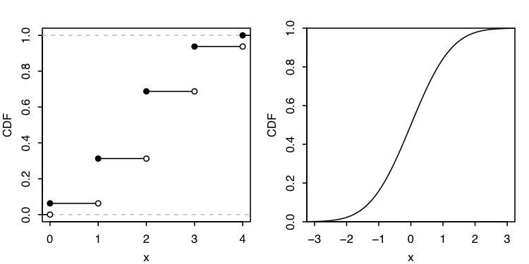
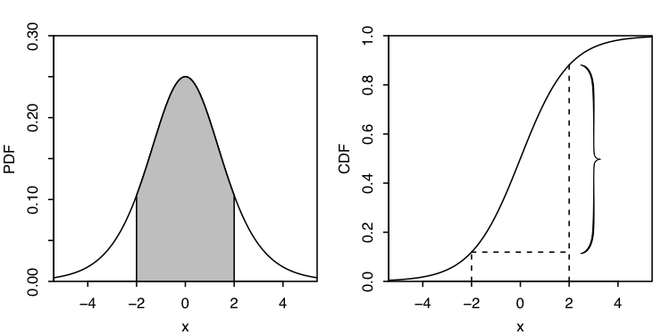

# 4 Continuous Random Variables

Together, discrete and continuous approaches form a powerful framework
for modeling the world.

## 4.1 Probability density function

Continuous RVs!

An RV has a *continuous distribution* if its CDF is differentiable. Endpoints of CDF may be continuous but not differentiable. A continuous RV is a RV with a continuous distribution.

For a continuous RV $X$ with CDF $F$, the PDF of $X$ is derivative $f$ of the CDF: $f(x)=F'(x)$

The support of $X$: all $x$ where $f(x)>0$.

The PDF is kinda similar to PMF, but for PDF quantity of $f(x)$ **is not a probability**. To obtaion the probability, we need to **integrate** PDF.

 We can be carefree about including or excluding endpoints as above for continuous RVs, but we must not be careless about this for discrete RVs.

Valid PDF of a continuous RV:

1. Nonnegative: $f(x) \geq 0$
2. Integrates to 1: $\int^{\infty}_{-\infty}f(x)dx=1$

Example: logistic distribution.

$X \sim$ Logistic.

CDF:

$$
F(x) = \frac{e^x}{1+e^x}, x \in \mathbb{R}
$$

PDF:

$$
F(x) = \frac{e^x}{(1+e^x)^2}, x \in \mathbb{R}
$$

To find $P(-2<X<2)$, we need to integrate PDF from $-2$ to $2$:

$$
P(-2<X<2) = \int^2_{-2}\frac{e^x}{(1+e^x)^2} = F(2)-F(-2) \approx 0.76
$$

Or $P(−2<X<2)$ is indicated by the shaded area under the PDF and the height of the curly brace on the CDF.

## 4.2 Uniform distribution

A continuous RV $U$ has the *Uniform distribution* $X \sim Unif(a, b)$ on the interval $(a, b)$ if its PDF is:

$$
f(x)=\frac{1}{b-a}\ \forall a < x < b,\\
f(x)=0\ otherwise
$$

The CDF is the accumulated area under the PDF:

$$
F(x)=0\ \forall x \leq a,\\
F(x)=\frac{x-a}{b-a}\ a < x < b,\\
F(x)=1\ \forall x \geq b.\\
$$

$Unif(0,1)$ is the standard Uniform.

For Uniform distributions, *probability is proportional to length.*

Location-scale transformation.

The RV $Y$ has been obtained as a *location-scale transformation* of $X$ if $Y=\sigma X + \mu$. $\mu$ controls the location and $\sigma$ controls the scale.

**Warning**: if $Y$ is a linear function of $X$, the Uniformity is preserved, but if $Y$ is defined as a *nonlinear* transformation of $X$, $Y$ will not be Uniform.

**Warning**: When using location-scale transformations, the shifting and scaling should be applied to the *random variables* themselves, not to their PDFs.

## 4.3 Universality of the Uniform distribution

Given a $Unif(0,1)$ RV, we can construct an RV with *any continuous distribution we want*.

Other names of the universality of Uniform:
 * probability integral transform,
 * inverse transform sampling,
 * the quantile transformation,
 * the fundamental theorem of simulation.

**Theorem:**

$F$ is a CDF which is continuous function and strictly increasing on the support of distribution. This ensures that the inverse function $F^{-1}$ exists as function $(0, 1) \rightarrow \mathbb{R}$. Results:

1. Let $U \sim Unif(0,1)$ and $X=F^{-1}(U)$. Then $X$ is an RV with CDF $F$.
2. Let $X$ be an RV with CDF $F$. Then $F(X) \sim Unif(0,1)$.

What this theorem is saying about?

Fist part: Since $F^{-1}$ is a function (**quantile function**), $U$ is a RV, and a function of RV is RV, $F^{-1}(U)$ is a RV; universality of the Uniform says its CDF is $F$.

Second part: reverse direction!
Starting from RV $X$ whose CDF is $F$ and then creating RV $Unif(0,1)$.
Universality of the Uniform says that the distribution of $F(X)$ is Uniform on $(0,1)$.

Warning: potential notational collusion!

$F(x)=P(X\leq x)$ by definition, but $F(X)=P(X\leq X)=1$ is incorrect by definition.
Rather, we should first find an expression for the CDF as a function of $x$, then replace $x$  with $X$ to obtain a random variable. For example, if the CDF of $X$ is $F(x)=1-e^{-1}$ for $x>0$, then $F(X)=1-e^{-X}$.

Example: percentiles

Exam, grades 0-100, RV $X$ is the score of random student. We approximate the discrete distribution of scores using continuous distribution. So $X$ is continuous RV, CDF is strictly increasing on $(0, 100)$. Suppose median score is $60$. So $F(60)=1/2$ or $F^{-1}(1/2)=60$

If student scores $72$ on the exam, then his **percentile** is the fraction of students who's score is below $72$. This is $F(72)$ which is number $(0.5,1)$. Other way, if we have percentile $0.95$, the score is $F^{-1}(0.95)$. Percentile is also called a *quantile*, $F^{-1}$ is *quantile function*.

The universality property says that $F(X) \sim Unif(0,1)$.

So! $50%$ of students have a percentile of at least $0.5$.
$10%$ have a percentile between $(0, 0.1)$, and between $(0.1, 0.2)$, ...

## 4.4 Normal distribution

A famous continuous distribution with a bell-shaped PDF!

A continuous RV $Z$ has the *standard Normal distribution* if its PDF $\varphi$ is:

$$
\varphi(z)=\frac{1}{\sqrt{2\pi}}e^{-z^2/2},\ -\infty < z < \infty.
$$

We write this as $Z\sim \mathcal{N}(0,1)$.

It is widely used in statistics because of the *central limit theorem*, which says that under very weak assumptions, the sum of a large number of IID (independent and identically distributed) RVs has an approximately Normal distribution, regardless of the distribution of the individual RVs.

Why it has $1/\sqrt{2\pi}$ in PDF? We need this constant to integrate PDF to $1$. Such constants are called *normalizing constants*.

The standard Normal $\varPhi$ CDF is the accumulated area under the PDF:

$$
\varPhi(z)=\int^z_{-\infty}\varphi(z)dt=\int^z_{-\infty}\frac{1}{\sqrt{2\pi}}e^{-t^2/2}dt
$$

So $\varphi$ is a standard Normal PDF, $\varPhi$ is a standard Normal CDF, $Z$ is standard Normal RV.

Normal PDF and CDF are looking similar to Logistic ones, but Normal PDF decays to $0$ more quickly: almost all the area under $\varphi$ is between $-3, 3$ while for Logistic PDF it is between $-5, 5$.

Properties of Normal PDF and CDF:

1. *Symmetry of PDF*: $\varphi(z)=\varphi(-z)$, $\varphi$ is an even function.
2. *Symmetry of tail areas*: The area under PDF curve is left to $-2$ equals to area to the right of $2$,
$$
\varPhi(z) = 1 - \varPhi(-z)\ \forall z
$$

Proof:
$$
\varPhi(z) = \int^{-z}_{-\infty}\varphi(t)dt=
 \int^{\infty}_{z}\varphi(u)du=
1-\int^{z}_{-\infty}\varphi(u)du=1-\varPhi(z)
$$

3. *Symmetry of $Z$ and $-Z$*: If $Z\sim \mathcal{N}(0,1)$, then $-Z\sim \mathcal{N}(0,1)$ as whell.

Proof:
$$
P(-Z\leq z)=P(Z\leq -z)=1 -\varPhi(-z)=\varPhi(z)
$$

**Normal distribution:**

If $Z\sim \mathcal{N}(0,1)$, then:
$$
X=\mu +\sigma Z
$$
Is normal distribution with mean parameter $\mu$ and variance parameter $\sigma^2$, $\forall$ real $\mu$, $\sigma^2$ and $\sigma > 0$. We denote this by: $X\sim \mathcal{N}(\mu,\sigma^2)$.

If $X\sim \mathcal{N}(\mu,\sigma^2)$,

$$
\frac{X-\mu}{\sigma} \sim \mathcal{N}(0,1).
$$

It is called *standardization*. We can use it to find PDF and CDF of $X$:

$$
F(x)=\varPhi(\frac{x-\mu}{\sigma}),\\
f(x)=\varphi(\frac{x-\mu}{\sigma})\frac{1}{\sigma}.
$$

**Important numbers** if $X\sim \mathcal{N}(\mu,\sigma^2)$, then
$$
P(|X-\mu|<\sigma) \approx 0.68 \\
P(|X-\mu|<2\sigma) \approx 0.95 \\
P(|X-\mu|<3\sigma) \approx 0.997
$$

## 4.5 Exponential distribution
