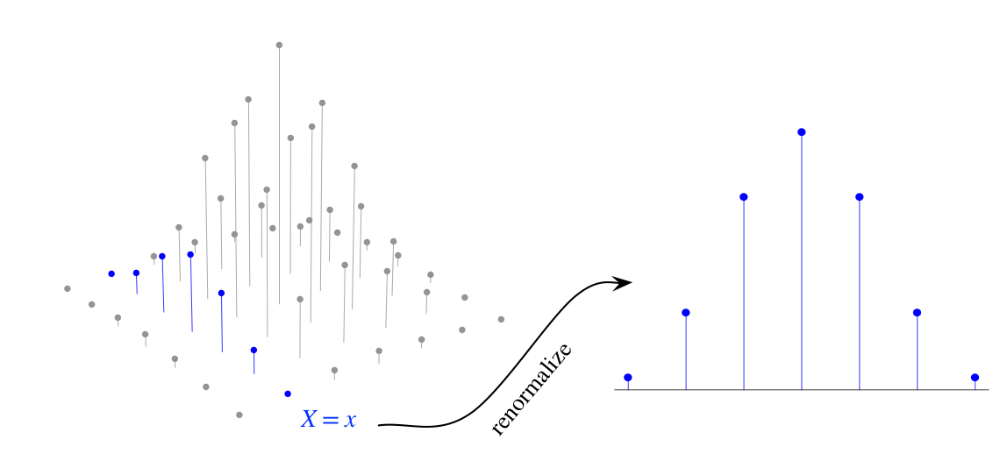
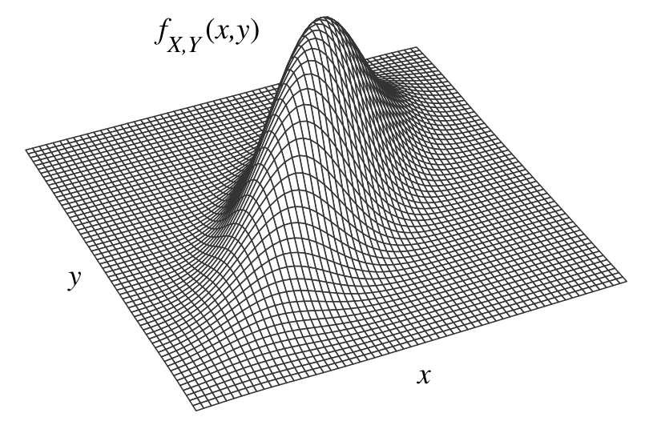
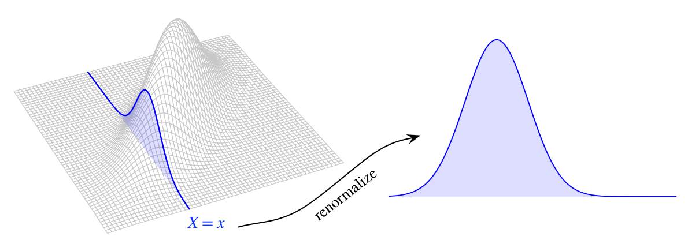
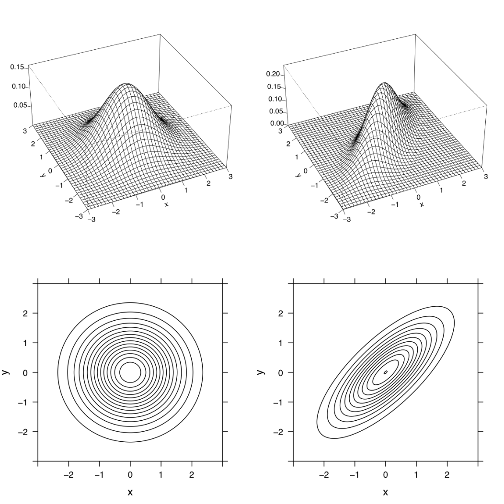

# 6 Joint Distributions and Conditional Expectation

With data coming from several groups, we should consider both *within* group variation and *between* group variation.

Using *conditional expectation*, we can predict the value of one random variable, given the information we have about other random variables.

## 6.1 Joint, marginal, and conditional distributions

We introduce multivariate analogs of the CDF, PMF, and PDF.

Key concepts:

* **Distribution** of RV $X$ provides complete information about the probability of $X$ into any subset of real line.
* **Joint distribution** of two RVs $X$ and $Y$ and provides complete information about the probability of the vector $(X,Y)$.
* **Marginal distribution** of $X$ is the individual distribution of $X$ ignoring the value of $Y$.
* **Conditional distribution** of $X$ given $Y=y$ is the updated distribution of $X$ after observing $Y=y$.

### Discrete joint CDF, PMF:

The **joint CDF** of RVs $X$ and $Y$ is the function $F_{XY}$ given by:

$$
F_{XY}(x,y)=P(X\leq x,Y\leq y)
$$

analogously for joint CDF of $n$ RVs.

The **joint PMF** of discrete RVs $X$ and $Y$ is the function $p_{XY}$, given by:

$$
p_{XY}(x,y)=P(X = x,Y = y)
$$

analogously for joint PMF of $n$ RVs.

We require valid joint PMF to be nonnegative and sum to $1$:

$$
\sum_x \sum_y P(X=x, Y=y)=1.
$$

**Marginal PMF:**
For discrete RVs $X$ and $Y$, the *marginal PMF* of $X$ is:

$$
P(X=x)=\sum_y P(X=x, Y=y)
$$

The operation of summering over the possible values of $Y$ in order to convert the joint PMF to marginal PMF is *marginalizing* out of $Y$.

Now: we observe the value of $X$ and want to update the distribution of $Y$ using this information. Using the marginal PMF isn't good idea because it doesn't take into account any info about $X$. Instead,

**Conditional PMF:**

$$
P(Y=y|X=x)= \frac{P(X=x, Y=y)}{P(X=x)}.
$$

Where $x$ is the observed value of $X$.
The conditional PMF $P(Y=y|X=x)$ is obtained by renormalizing the column of the joint PMF that is compatible with the event $X=x$.

We can also obtain the conditional distribution using Bayes' rule:

$$
P(Y=y|X=x)=\frac{P(X=x|Y=y)P(Y=y)}{P(X=x)}.
$$

Using LOTP, we have another way to get the marginal PMF:

$$
P(X=x)=\sum_y P(X=x|Y=y)P(Y=y)
$$

Now we can revisit the definition of **independence**:

RVs $X$ and $Y$ are *independent* if $\forall x, y$,

$$
F_{X,Y}(x,y)=F_X(x)F_Y(y).
$$

If $X$ and $Y$ are discrete, it is equivalent to:

$$
P(X=x,Y=y)=P(X=x)P(Y=y)
$$

$\forall x, y$ and it is also equivalent to:

$$
P(Y=y|X=x)=P(Y=y)
$$

$\forall y$ and $\forall x$ such that $P(X=x)>0$.

For independent RVs, the *joint CDF* factors into the product of the *marginal CDFs*, or that the *joint PMF* factors into the product of the *marginal PMFs*.

Another way of looking at independence: *all the conditional PMFs* are the same as the *marginal PMFs*. In other words, starting with marginal PMF of $Y$, no updating is necessary when we condition on $X=x$, regardless of $x$. There is no event involving $X$ that influences our distribution of $Y$.

### Continuous joint CDF, PDF:

In order for $X$ and $Y$ to have a continuous joint distribution, we require that the joint CDF is:

$$
F_{X,Y}=P(X\le x, Y\le y)
$$

be differentiable with respect to $x$ and $y$. The partial derivative with respect to $x$ and $y$ is called *the joint PDF*.

**Joint PDF:**

If $X$ and $Y$ are continuous with joint CDF $F_{X,Y}$, their joint PDF is:

$$
f_{X,Y}(x,y)= \frac{\partial^2}{\partial x \partial y}F_{X,Y}(x,y).
$$

As usual, we require valid joint PDFs to be nonnegative and integrate to 1.

How joint PDF of two RVs looks like:

**Marginal PDF:**

In continuous case, we get the marginal PDF of $X$ by integrating over all possible values of $Y$:

For continuous RVs $X$ and $Y$ with joint PDF $f_{X,Y}$, the *marginal PDF* of $X$ is

$$
f_{X}(x)=\int^{\infty}_{-\infty}f_{X,Y}(x,y)dy
$$

If number of RVs is bigger, we can do the same, for example for four RVs $X,Y,Z,W$ if we need the joint PDF of $X,W$:

$$
f_{X,W}(x, w)=\int^{\infty}_{-\infty}\int^{\infty}_{-\infty}
f_{X,Y,Z,W}(x, y, z, w)dydz.
$$

Computing the integral may be difficult!

How to update our distribution for $Y$ after observing the value of $X$ using the *conditional PDF*?

**Conditional PDF:**

For continuous RVs $X$ and $Y$ with joint PDF $f_{X,Y}$, the *conditional PDF* of $Y$ given $X=x$ is

$$
f_{Y|X}(y|x)=\frac{f_{X,Y}(x,y)}{f_X(x)}.
$$

this is considered as a function of $y$ for fixed $x$.

The conditional PDF $f_{Y|X}(y|x)$ is obtained by renormalizing the slice of the joint PDF at the fixed value $x$:

We can recover joint PDF $f_{X,Y}$ if we have conditional PDF $f_{Y|X}$:

$$
f_{X,Y}=f_{Y|X}(y|x)f_X(x),
$$

similarly for $f_{X|Y}$:

$$
f_{X,Y}=f_{X|Y}(x|y)f_Y(y).
$$

So we can develop Bayes' rule and LOTP for continuous case:

**Continuous form of Bayes' rule and LOTP**

For continuous RVs $X$ and $Y$,

$$
f_{Y|X}(y|x)=\frac{f_{X|Y}(x|y)f_Y(y)}{f_X(x)}, \\
f_X(x)=\int^{\infty}_{-\infty}f_{X|Y}(x|y)f_Y(y)dy.
$$

We now have versions of Bayes' rule and LOTP for two discrete RVs and for two continuous RVs, so we can create Bayes' rule and LOTP for different mixes of RVs.

Bayes' rule for continuous $X$ and discrete $Y$:

$$
P(Y=y|X=x)=\frac{f_X(x|Y=y)P(Y=y)}{f_X(x)};
$$

Bayes' rule for discrete $X$ and continuous $Y$:

$$
f_Y(y|X=x)=\frac{P(X=x|Y=y)f_y(y)}{P(X=x)}.
$$

LOTP for continuous $X$ and discrete $Y$:

$$
f_X(x)=\sum_y f_X(x|Y=y)P(Y=y);
$$

LOTP for discrete $X$ and continuous $Y$:

$$
P(X=x)=\int^{\infty}_{-\infty} P(X=x|Y=y)f_Y(y)dy.
$$

Finally, we can define the independence for continuous RVs:

**Independence of continuous RVs:**

RVs $X$ and $Y$ are *independent* if $\forall x,y$

$$
F_{X,Y}(x,y)=F_X(x)F_Y(y),
$$

if $X$ and $Y$ are continuous with joint PDF $f_{X,Y}$, this is equivalent to:

$$
f_{X,Y}(x,y)=f_X(x)f_Y(y),
$$

$\forall x,y$, this is also equivalent to:

$$
f_{X|Y}(y|x)=f_Y(x)
$$

$\forall y, x$ such that $f_X(x)>0$.

## 6.2 Covariance and correlation.

Roughly speaking, covariance measures of two RVs to go up or down together, relative to their expected values.

**Covariance**

The *covariance* between RVs $X$ and $Y$ is

$$
Cov(X,Y)=E((X-EX)(Y-EY)).
$$

Multiplying this out and using linearity,

$$
Cov(X,Y)=E(XY)-E(X)E(Y).
$$

If $X$ and $Y$ tend to move in the same direction, then $X-EX$ and $Y-EY$ are both positive or both negative, and we receive a positive covariance.

If $X$ and $Y$ are independent, their covariance is zero. RVs with zero covariance are *uncorrelated*.

Examples:

**Properties of covariance:**

1. $Cov(X,X)=Var(X)$
2. $Cov(X,Y)=Cov(Y,X)$
3. $Cov(X,c)=0\ \forall const\ c$
4. $Cov(aX,Y)=aCov(X,Y)\ \forall const\ a$
5. $Cov(X+Y,Z)=Cov(X,Z)+Cov(Y,Z)$
6. $Cov(X+Y,Z+W)=Cov(X,Z)+Cov(X,W)+\\+Cov(Y,Z)+Cov(Y,W)$
7. $Var(X+Y)=Var(X)+Var(Y)+2Cov(X,Y)$
8. For $n$ RVs $X_1,...,X_n$,

$$
Var(X_1+...+X_n)=Var(X_1)+...+Var(X_n)+2\sum_{i<j}Cov(X_i,X_j).
$$

Correlation is a unitless version of covariance:

**Correlation**

The *correlation* between RVs $X$ and $Y$ is:

$$
Corr(X,Y)=\frac{Cov(X,Y)}{\sqrt{Var(X)Var(Y)}}.
$$

Undefined if $Var(X)=0$ or $Var(Y)=0$.

Shifting and scaling $X$ and $Y$ has no effect on their correlation:

$$
Corr(cX,Y)=\frac{Cov(cX,Y)}{\sqrt{Var(cX)Var(Y)}}=
\frac{cCov(X,Y)}{\sqrt{c^2Var(X)Var(Y)}}=Corr(X,Y).
$$

$\forall$ RVs $X$ and $Y$,

$$
-1 \leq Corr(X,Y) \leq 1.
$$

**Hypergeometric variance:**

Let $X\sim HGeom(w,b,n)$. $Var(X)=?$

RV $X$ is a sum of indicator RVs, $X=I_1+...+I_n$. Each $I_j$ has mean $p=w/(w+b)$ and var $p(1-p)$. Let's apply properties of covariance:

$$
Var(X)=Var(\sum^n_{j=1}I_j)=Var(I_1)+...+Var(I_n)+\\
+2\sum_{i<j}Cov(I_i,I_j)=np(1-p)+2\binom{n}{2}Cov(I_1,I_2).
$$

all $\binom{n}{2}$ pair of $I_j$ have the same covariance by symmetry. By the definition,

$$
Cov(I_1,I_2)=E(I_1,I_2)-E(I_1)E(I_2)=\\
P(1st\ and\ 2nd\ white)-P(1st\ white)P(2nd\ white)=\\
\frac{w}{w+b}\frac{w-1}{w+b-1}-p^2.
$$

Now we can obtain:

$$
Var(X)=\frac{w+b-n}{w+b-1}bp(1-p).
$$

## 6.3 Multinomial distribution

The Multinomial distribution is a generalization of the Binomial.

Objects are places into category $j$ with probability $p_j$ where $p_j > 0$ and $\sum^k_{j=1}p_j=1$. Let $X_1$ be number of objects in category $1$, $X_j$ in $j$, so $\sum^k_{j=1}X_j=n$.
Then $\textbf{X}=(X_1,...X_j)$ has the *Multinomial distribution*
$\textbf{X} \sim Mult_k(n, \textbf{p})$ with params $n, \textbf{p}=(p_1,...p_k)$.

$\textbf{X}$ is a *random vector*!

**Multinomial joint PMF**

If $\textbf{X} \sim Mult_k(n, \textbf{p})$, then the joint PMF of $\textbf{X}$ is:

$$
P(X_1=n_1,...,X_k=n_k)=\frac{n!}{n_1!n_2!...n_k!}
p_1^{n_1}p_2^{n_2}...p_k^{n_k}.
$$

and $n_1+...+n_k=n$

**Multinomial magrnials**

If $\textbf{X} \sim Mult_k(n, \textbf{p})$, then $X_j \sim Bin(n,p_j)$.

Another property of the Multinomial distribution:

**Multinomial lumping:**

If $\textbf{X} \sim Mult_k(n, \textbf{p})$, then $\forall i,j,\ i \neq j$, then $X_i + X_j \sim Bin(n,p_i + p_j)$.

The random vector of counts obtaining by merging $i$ and $j$ is still Multinomial. For example for $1$ and $2$:

$$
(X_1 + X_2,X_3,...,X_k)\sim Mult_{k-1}(n(p_1+p_2,p_3,...,p_k)).
$$

**Covariance in Multinomial:**

Let $(X_1,...,X_k)\sim Mult_{k-1}(n, \textbf{p})$.
For $i \neq j$,

$$
Cov(X_i,X_j)=-np_i p_j.
$$

## 6.4 Multivariate Normal

The Multivariate Normal (MVN) generalizes the Normal distribution into higher dimensions.

**Multivariate Normal distribution:**

A random vector $\textbf{X}=(X_1,...,X_k)$ has *Multivariate Normal distribution* (MVN) if every linear combination of $X_j$ has a Normal distribution:

$$
t_1 X_1+...+t_k X_k \sim \mathcal{N}
$$

$\forall t_1,...,t_k$.

Important case is $k=2$: this distribution is *Bivariate Normal* (BVN)

**Example: Not a MVN**

Let $X \sim \mathcal{N}(0,1)$, and let $S=1$ with $P=0.5$ and $S=-1$ with $P=0.5$ be a random sign independent of $X$. Then $Y=SX$ is a standard Normal RV. However, $(X,Y)$ is not Bivariate Normal because $P(X+Y=0)=P(S=-1)=1/2$ which implies that $X+Y$ can't be Normal. Since $X+Y$ is a linear combination of $X$ and $Y$ that is not Normally distributied, $(X,Y)$ is not BVN.

**Example: Actual MVN**

For $Z,W\sim^{i.i.d.} \mathcal{N}(0,1)$, $(Z, W)$ is BVN.
Also $(Z+2W,3Z+5W)$ is BVN too.

**Property:**

If $(X_1,X_2,X_3)$ is MVN, then subvector is $(X_1,X_2)$ MVN too.

**Property:**

If $\textbf{X}=(X_1,...,X_n)$ and $\textbf{Y}=(Y_1,...,Y_n)$ are independent MVN vectors, a concatenated random vector $\textbf{W}=(X_1,...,X_n,Y_1,...,Y_n)$ is MVN.

Parameters of MVN random vector $(X_1,...X_k)$ are the following:

* the *mean vector* $(\mu_1,...\mu_k)$ where $E(X_j)=\mu_j$
* the *covariance matrix* which is $k \times k$ matrix of covariances between components.

And for BVN $(X, Y)$ we need to know 5 parameters:

* the means $E(X), E(Y);$
* the vars $Var(X), Var(Y);$
* the correlation $Corr(X, Y);$

Example: BVN with $Corr(X, Y)=0$ vs BVN with $Corr(X, Y)=0.75$:

 

**Property:**

Within an MVN random vector, uncorrelated implies independent.

For example, if $(X, Y)$ is BVN and $Corr(X,Y)=0$, then $X$ and $Y$ are independent.

## 6.5 Conditional expectation

Conditional expectation is expectation with conditional probability in terms of probability.

Two notions of conditional expectation:

* *Conditional expectation* $E(Y|A)$ given an event $A$. If we learn that $A$ occurred, updated expectation of $Y$ is computed analogously to $E(Y)$.
* *Conditional expectation* $E(Y|X)$ given an random variable $X$. $E(Y|X)$ is the RV that best predicts $Y$ using only the information available from $X$.

For discrete RV $Y$, the definition of $E(Y|A)$ replaces the probability $P(Y=y)$ with conditional probability $P(Y=y|A)$.

For continuous RV $Y$, the definition of $E(Y|A)$ replaces the PDF $f(y)$ with conditional probability PDF $f(y|A)$.

**Conditional expectation given an event:**

Let $A$ be an event with $P(A)>0$ If $Y$ is a discrete RV, then the *condition expectation of $Y$ given* $A$ is:

$$
E(Y|A)=\sum_y yP(Y=y|A)
$$

sum over support of $y$. If $Y$ is continuous RV with PDF $f$:

$$
E(Y|A)=\int^{\infty}_{-\infty}yf(y|A)dy
$$

where conditional PDF $f(y|A)$ is the derivative of conditional CDF $F(y|A)=P(Y\leq y|A)$ computed by Bayes' rule:

$$
f(y|A)=\frac{P(A|Y=y)f(y)}{P(A)}.
$$

**Warning:**

Confusing conditional expectation and unconditional expectation is a dangerous mistake!

**Law of total expectation (LOTE):**

$A_1,...,A_n$ is a partition of a sample space, with $P(A_j)>0\ \forall i$, and $Y$ is a RV on this sample space. Then

$$
E(Y)=\sum_{i=1}^n E(Y|A_i)P(A_i).
$$

Since all probabilities are expectations by the fundamental bridge, LOTP is a special case of LOTA. Let $Y=I_B$ for event $B$, then

$$
P(B)=E(I_B)=\sum_{i=1}^n E(I_B|A_i)P(A_i)=\sum_{i=1}^n E(B|A_i)P(A_i).
$$

which is LOTP!

The law of total expectation is, in turn, a special case of a major result called *Adam's law*.

## 6.6 Conditional expectation given a random variable

$E(Y|X)$ is a random variable that is, in a certain sense, our best prediction of $Y$, assuming we get to know $X$.

If $Y$ is discrete, we use use the conditional PMF $P(Y=y|X=x)$ in place of conditional PMF $P(Y=y)$:

$$
E(Y|X=x)=\sum_y yP(Y=y|X=x).
$$

If $Y$ is continuous, we use conditional PDF:

$$
E(Y|X=x)=\int^{\infty}_{-\infty}yf_{Y|X}(y|x)dy.
$$

Notice that $E(Y|X=x)$ is a function of $x$ only. Therefore,

**Conditional expectation given an RV:**

Let $g(x)=E(Y|X=x)$. Then the conditional expectation of $Y$ given $X$ $E(Y|X)$ is defined to be the RV $g(X)$. If after experiment $X$ crystallized into $x$, $E(Y|X)$ crystallizes into $g(x)$.

**Warning 1:**

This definition doesn't say $g(x)=E(Y|X=x)$ then $g(X)=E(Y|X=X)$ which equals $E(Y)$ because $X=X$ is always true.

**Warning 2:**

We should always keep in mind that $E(Y|A)$ are numbers, while $E(Y|X)$ are RVs.

## 6.7 Adam's law and other properties of conditional expectation

**Properties of conditional expectation:**

* Dropping independent: if $X$, $Y$ are independent, $E(Y|X)=E(Y)$.
* Taking out what's known: $\forall$ func $h$, $E(h(X)Y|X)=h(X)E(Y|X)$.
* Linearity: $E(Y_1 + Y_2|X)=E(Y_1|X)+E(Y_2|X)$ and $E(cY|X)=cE(Y|X)$ $\forall$ const $c$.
* Adam's law: $E(E(Y|X))=E(Y)$.
* Projection interpolation: the RV $Y-E(Y|X)$ which is called the *residual* from using $X$ to predict $Y$, is uncorrelated with $h(X)$ $\forall$ func $h$.
