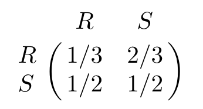
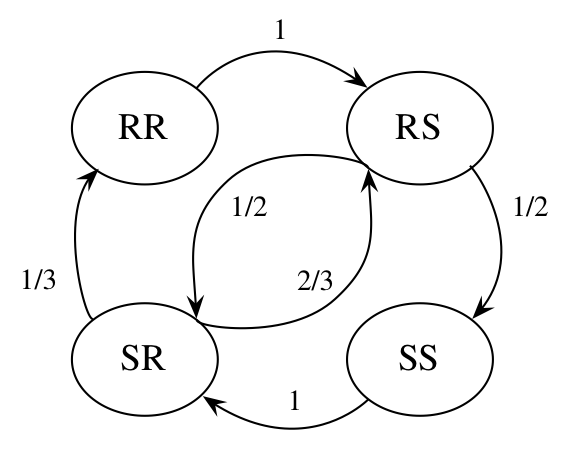
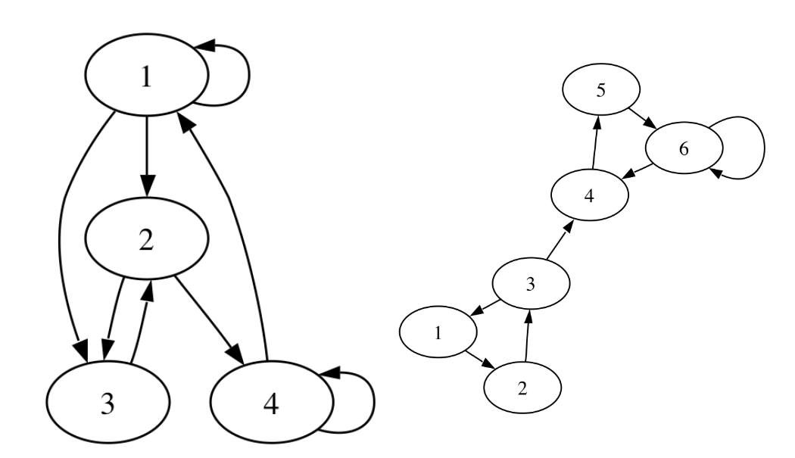

# 7 Markov Chains

For the Markov chain, the past and **the future are conditionally independent**. For the special case of random walk on an undirected network, the network structure is the key to determining the stationary distribution.

We can picture a Markov chain intuitively by imagining a system with *states* and someone randomly wandering around from state to state.

 For many interesting Markov chains, the *stationary* distribution of the chain helps us understand how the chain will behave in the long run.

## 7.1 Markov property and transition matrix

A sequence of RVs $X_0, X_1, X_2, ...$ evolving over time. This is called a *stochastic process*.

Markov chains have a form of one-step dependence, allowing to do beyond IIDs bust still have very convenient structure.

Markov chains widely used for simulations of complex distributions, via algorithms known as *Markov chain Monte Carlo (MCMC).*

Markov chains live in both space and time: the set of possible states $X_n$ is called *state time*, and index $n$ represents evolution of the process over *time*. The state space of can be discrete or continuous, and time can also be discrete or continuous. We will focus on *discrete-state*, *discrete-time* Markov Chains with a *finite* state space.

**Markov Chain**

A sequence of RVs $X_0, X_1, X_2, ...$ taking values in *state space* $\{1, 2,...,M\}$ is called *Markov chain* $\forall\ n \geq 0$,

$$
P(X_{n+1}=j|X_n=i,X_{n-1}={i-1},...,X_0=i_0) = P(X_{n+1}=j|X_n=i)
$$

$P(X_{n+1}=j|X_n=j)$ is called the *transition probability.* from state $i$ to state $j$. This Markov chain is $time-homogeneous$, which means that $P(X_{n+1}=j|X_n=j)$ is the same $\forall\ n$.

 We can describe the probabilities of moving from state to state using a matrix called *translation matrix* whose $i,j$ entry is probability of going from $i$-th to $j$-th state in a single step.

**Translation matrix**

Let $X_0, X_1, X_2, ...$ be a Markov chain $\{1, 2,...,M\}$ and let $q_{ij}=P(X_{n+1}=j|X_n=i)$ be transition probability from state $i$ to state $j$. The matrix $Q=(q_{ij})$ is the *transition matrix* of the chain. $Q$ is nonnegative and each row sums to $1$.

**Example: Rainy-sunny Markov chain**

If today is rainy, tomorrow it will be rainy with $P=1/3$ and sunny with $P=2/3$. If today is sunny, tomorrow it will be rainy with $P=1/2$ and sunny with $P=1/2$.

Let $X_n$ be the weather on day $n$ and $X_0, X_1, X_2, ...$ is a Markov chain on the state space $\{R,S\}$. Translation matrix of this chain is:

Also we can represent this chain as graph:

And what if tomorrow's weather depends on today's and yesterday's weather? To illustrate it, we can create a new Markov chain.
Let $Y_n=(X_{n-1},X_n)\ \forall n \geq 1$. Then $Y_1, Y_2, ...$ is a Markov chain on the state space $\{(R,R)(R,S),(S,R),(S,S)\}$.

Translation matrix of this chain is:

This Markov chain may be represented as the following graph:

Similarly, we can build a chain on n-order dependencies.

**N-step transition probability**

The n-step transition probability $q^{(n)}_{ij}$ from $i$ to $j$ is the probability of being at $j$ exactly $n$ steps after being at $i$.

$$
q^{(n)}_{ij} = P(X_n=j|X_0=i).
$$

Of course,

$$
q^{(n)}_{ij} = \sum_k q_{ik}q_{kj}.
$$

The $n$-th power of the transition matrix gives the $n$-step transition probabilities $q^{(n)}_{ij}$ is the $(i,j)$-th entry of $Q^n$.

**Marginal distribution of X_n**

Let $\mathbf{t}=(t_1, t_2, ...)$ where $t_i=P(X_0=i)$ and $\mathbf{t}$ is a row vector. Then *the marginal distribution* of $X_n$ is given by the vector $\mathbf{t}Q^n$ is $P(X_n=j)$.

Proof:

By LOTA, conditioning on $X_0$, the probability that the chain is at $j$-th state after $n$ steps is:

$$
P(X_n=j)=\sum^M_{i=1}P(X_0=i)P(X_n=j|X_0=i)=\\
=\sum^M_{i=1}t_i q_{ij}^{(n)}
$$

which is the $j$th component of $\mathbf{t}Q^n$.

## 7.2 Classification of states

States may be *recurrent* or *transient*. Recurrent ones will be visited over and over again in the long one while transient ones will be constantly abandoned.

Also states may be classified using their *period* which is a possible integer summarizing the amount of time that can be elapsed between visits to this state.

**Recurrent and transient states:**

State $i$ of a Markov chain is recurrent if starting from $i$, the $P=1$ that the chain will return to $i$.
The state $i$ is transient if the chain starts from $i$ there is $P>0$ that the chain will never return to $i$.

As long as there is a positive probability of leaving $i$ forever, the chain eventually will leave $i$ forever!

If $i$ is a transient state of a Markov chain,
and the probability of never returning to $i$ starting from $i$ is a positive number $p > 0$.
Then the number of returns to $i$ before leaving it forever is $\sim Geom(p)$.

**Irreducible and reducible chain:**

A Markov chain with transition matrix $Q$ is *irreducible* if for $\forall$ $i,j$ it is possible to go from $i$ to $j$ in a finite number of steps with $P>0$. So $\forall$ $i,j$
there is integer $n>0$ that $(i,j)$-th entry of $Q^n$ is positive.

Not *irreducible* Markov chain is *reducible*.

In an irreducible Markov chain with a finite state space, all states are recurrent.

**Period of a state, periodic and aperiodic chain:**

The *period* of a state $i$ in a Markov chain is the greatest common divisor (gcd) of the possible numbers of steps it can take to return to $i$ when starting at $i$. The period of $i$ is the greatest common divisor of numbers $n$ such that $(i,j)$-th entry of $Q^n$ is positive.

A state is called *aperiodic* if period $=1$ and *periodic* otherwise. The chain is *aperiodic* of all the states are *aperiodic*, and *periodic* otherwise.

Examples:

Left: aperiodic Markov chain

Right: periodic Markov chain with states $1,2,3$ with period $3$.

## 7.3 Stationary distribution

What fraction of time will it spend in each recurrent of states? This question is answered by *stationary distribution* a.k.a. *steady-state distribution*.

**Stationary distribution:**

A row vector $\mathbf{s}=(s_1,...,s_M)$ such that $s_i \geq 0$ and $\sum_i s_i=1$ is a *stationary distribution* for a Markov chain with transition matrix $Q$ if:

$$
\sum_i s_i q_{ij}=s_j
$$

$\forall\ j$, or equivalently,

$$
\mathbf{s}Q=\mathbf{s}.
$$

If $\mathbf{s}$ is the distribution of $X_0$, then $\mathbf{s}Q$ is the marginal distribution of $X_1$. But the equation $\mathbf{s}Q=\mathbf{s}$ means that $X_1$ has the distribution $\mathbf{s}$. Same for $X_2$, $X_3$, etc.

Properties:

**Existence and uniqueness:**

Any irreducible Markov chain has a unique stationary distribution.
In this distribution, every state has a positive probability.

**Convergence:**

Let $X_0, X_1,...$ be a Markov chain with a stationary distribution $\mathbf{s}$ and transition matrix $Q$, such that some power $Q^m$ is positive in all entries. Then $P(X_n=i)$ converges to $s_i$ as $n \rightarrow \infty$. In terms of transition matrix, $Q^n$ converges to $\mathbf{s}$ in each row.

**Expected time to return:**

Let $X_0, X_1,...$ be a Markov chain with a stationary distribution $\mathbf{s}$. Let $r_i$ be the expected time it takes the chain to return to $i$, given that it starts at $i$. Then, $s_i=1/r_i$.

Example of usage: Google PageRank. Founders of Google modeled web-surfing as Markov chain and then used its stationary distribution to rank the relevance of webpages.

## 7.4 Reversibility

Stationary distribution is useful for understanding long-run behavior, but it may be computationally difficult to find the stationary distribution when state space is large.

**Reversibility:**

Let $Q=(q_{ij})$ is the transition matrix of a Markov chain. Suppose $\mathbf{s}=(s_1,...,s_M)$ where $s_i \geq 0, \sum_i s_i=1$ such that

$$
s_i q_{ij}=s_j q_{ji}
$$

$\forall\ i,j$ This equation is *reversibility* or *detailed balance* condition, and the chain is *reversible* with respect to $\mathbf{s}$ if it holds.

So with a transition matrix, we can find a nonnegative vector $\mathbf{s}$ which sums to $1$ then it is a stationary distribution!

**Reversible implies stationary**

If $Q=(q_{ij})$ is a transition matrix of a Markov chain that is reversible with respect to a nonnegative $\mathbf{s}=(s_1,...,s_M)$ and $\sum_i s_i=1$, $\mathbf{s}$ is a stationary distribution of the chain.

Why?

$$
\sum_i s_i q_{ij}= \sum_i s_j q_{ji} = s_j \sum_i q_{ji} = s_j
$$

Using this result, we can easily verify the reversibility condition which may be simpler than solving the system of equations $\mathbf{s}Q=\mathbf{s}$. We will look at $3$ types of Markov chains where is is possible to find an $\mathbf{s}$ that satisfies the reversibility. These Markov chains are called *reversible*.

If each column of $Q$ sums to $1$, then the uniform distribution over all states, $(1/M,1/M,...,1/M)$ is a stationary distribution.
A nonnegative matrix whose columns are all equal to $1$ is *doubly stochastic matrix*.

If the Markov chain is a *random walk on an undirected network*, then there is a simple formula for the stationary distribution.

**Network** is a collection of *nodes* joined by *edges*; it is undirected if you can travel through edges in both directions.

Example:

The *degree* of a node is the number of attached edges.
The *degree sequence* is vector $(d_1,...,d_n)$ where $d_j$ is a degree of $j$-th node. If the edge is from node to itself, it is called a *self-loop* and counts as $1$ in the degree of that node.

For network above, it has a degree sequence $\mathbf{d}=(4,3,2,3,2)$. Also

$$
d_i q_{ij}=d_j q_{ji}\ \forall i,j
$$

because $q_{ij}$ is $1/d_i$ if there's an edge, else $0$. Therefore, the stationary distribution is proportional to the degree sequence. For the network above, $\mathbf{s}=(\frac{4}{14},\frac{3}{14},\frac{2}{14},\frac{3}{14},\frac{2}{14})$.

**FIN.**
