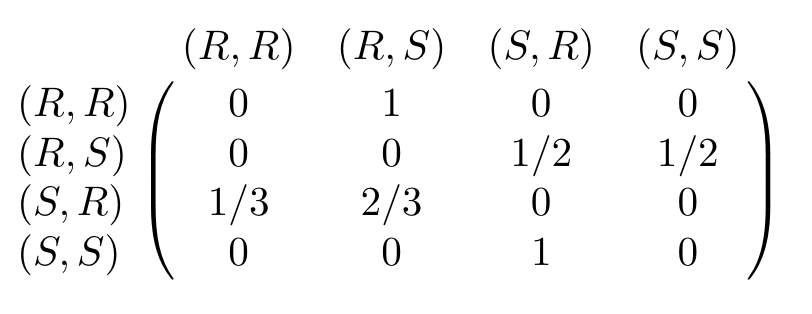

# 7 Markov Chains

For the Markov chain, the past and **the future are conditionally independent**. For the special case of random walk on an undirected network, the network structure is the key to determining the stationary distribution.

We can picture a Markov chain intuitively by imagining a system with *states* and someone randomly wandering around from state to state.

 For many interesting Markov chains, the *stationary* distribution of the chain helps us understand how the chain will behave in the long run.

## 7.1 Markov property and transition matrix

A sequence of RVs $X_0, X_1, X_2, ...$ evolving over time. This is called a *stochastic process*.

Markov chains have a form of one-step dependence, allowing to do beyond IIDs bust still have very convenient structure.

Markov chains widely used for simulations of complex distributions, via algorithms known as *Markov chain Monte Carlo (MCMC).*

Markov chains live in both space and time: the set of possible states $X_n$ is called *state time*, and index $n$ represents evolution of the process over *time*. The state space of can be discrete or continuous, and time can also be discrete or continuous. We will focus on *discrete-state*, *discrete-time* Markov Chains with a *finite* state space.

**Markov Chain**

A sequence of RVs $X_0, X_1, X_2, ...$ taking values in *state space* $\{1, 2,...,M\}$ is called *Markov chain* $\forall\ n \geq 0$,

$$
P(X_{n+1}=j|X_n=i,X_{n-1}={i-1},...,X_0=i_0) = P(X_{n+1}=j|X_n=i)
$$

$P(X_{n+1}=j|X_n=j)$ is called the *transition probability.* from state $i$ to state $j$. This Markov chain is $time-homogeneous$, which means that $P(X_{n+1}=j|X_n=j)$ is the same $\forall\ n$.

 We can describe the probabilities of moving from state to state using a matrix called *translation matrix* whose $i,j$ entry is probability of going from $i$-th to $j$-th state in a single step.

**Translation matrix**

Let $X_0, X_1, X_2, ...$ be a Markov chain $\{1, 2,...,M\}$ and let $q_{ij}=P(X_{n+1}=j|X_n=i)$ be transition probability from state $i$ to state $j$. The matrix $Q=(q_{ij})$ is the *transition matrix* of the chain. $Q$ is nonnegative and each row sums to $1$.

**Example: Rainy-sunny Markov chain**

If today is rainy, tomorrow it will be rainy with $P=1/3$ and sunny with $P=2/3$. If today is sunny, tomorrow it will be rainy with $P=1/2$ and sunny with $P=1/2$.

Let $X_n$ be the weather on day $n$ and $X_0, X_1, X_2, ...$ is a Markov chain on the state space $\{R,S\}$. Translation matrix of this chain is:

Also we can represent this chain as graph:

And what if tomorrow's weather depends on today's and yesterday's weather? To illustrate it, we can create a new Markov chain.
Let $Y_n=(X_{n-1},X_n)\ \forall n \geq 1$. Then $Y_1, Y_2, ...$ is a Markov chain on the state space $\{(R,R)(R,S),(S,R),(S,S)\}$.

Translation matrix of this chain is:

This Markov chain may be represented as the following graph:

Similarly, we can build a chain on n-order dependencies.

**N-step transition probability**

The n-step transition probability $q^{(n)}_{ij}$ from $i$ to $j$ is the probability of being at $j$ exactly $n$ steps after being at $i$.

$$
q^{(n)}_{ij} = P(X_n=j|X_0=i).
$$

Of course,

$$
q^{(n)}_{ij} = \sum_k q_{ik}q_{kj}.
$$

The $n$-th power of the transition matrix gives the $n$-step transition probabilities $q^{(n)}_{ij}$ is the $(i,j)$-th entry of $Q^n$.
